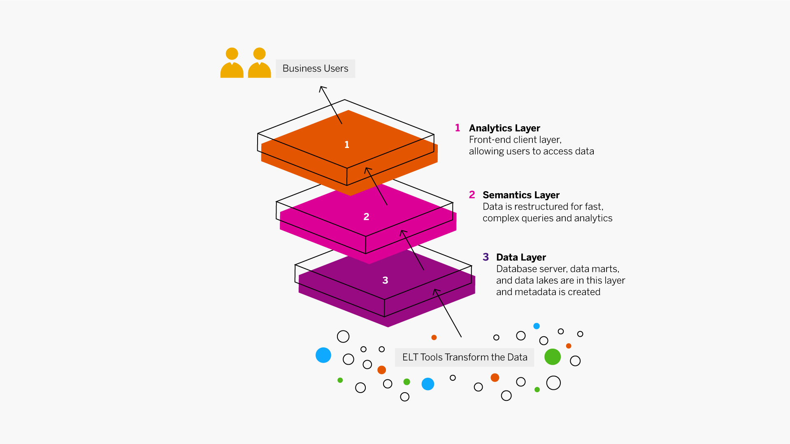
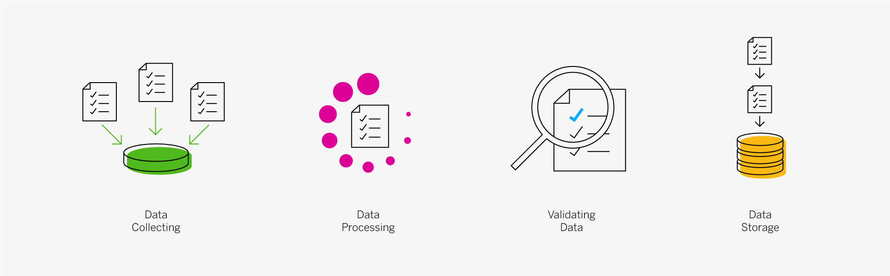

# BigData --> Day #1

## How does this session help you?

1. Understand how BigData is leveraged by the Industry; Taking the solutions to production within the Enterprise
2. The What's, Why's & How's that'll help you land BigData & Hadoop better with the students in a handson mode - inline with the curriculum
   1. BigData
      1. Analytics Applications & Case studies
      2. Designing Data architectures
      3. Data Sources
      4. Parallel Processing
      5. Quality
      6. Pre-Processing & Storing
      7. Data Storage & Analysis
   2. Hadoop - Handson - Componens, Tools, Usage examples
      1. Ecosystem
      2. HDFS
      3. Yarn
      4. Map/Reduce
      5. Tools
      6. How Hadoop works behind the scenes
   3. Map-Reduce, Hive & Pig in Detail
      1. Tasks / Jobs
      2. Configurations
      3. Mappers
      4. Reducers
      5. Hive
      6. HiveQL
      7. Pig
3. These sessions shall cover breadth of the big-data related technologies & their broader usage

## Introduction to Hadoop
1. The need for big data - Why? w Industry needs & case studies (10 mins)
2. The Solution - How? To deal with big data & volumes; The Process & Phases involed with a easy to understand usecase (30 mins)
  a. Predictions of student performance & results at a college level, university levels
  b. Data Points : Attendence - per college/per stream/per day/per subject; Co-relation of Assignments, Projects, Internship, Exams data
3. The Tools - What? Hadoop history (20 mins)
4. The Tools - What? Hadoop ecosystem (40 mins)
5. Q&A - (20 mins)

### The need for big data - Why? w Industry needs - use cases & case studies (10 mins)
<!-- https://insights.sap.com/what-is-big-data/ -->
*Collect, Store, Analyze*

 1. With the advent of Mobiles, Cloud, 4G & explosion of WWW, AI & ML; the scale & performance needs have sky rocketed!
 - The distruptors (FAANG/Big Tech.) with their focus towards hyper personalization & customers centricity 
 has driven Enterprises new & old alike to relook at their digital modernization/transformation 
 with data at the center, playing a core role across B2B & B2C landscapes;
 - To build a better & accurate understanding of customer needs means collecting, storing, processing humongous transactional volumes for millions of customers, every day; (ie.,) building a Customer Data Platform
- Examples / Usecases:
- CDP (Customer Data Platforms) & Martech (Marketing Tech.) 
- --> Consumer Personas, Understand customer behavior & wants accurately; New customer acquistion, increase customer loyalty of existing customer base
- --> Campaigns, Customer Experience Optimization by Segmentation - Relevant Mails, ADs, Curated Content, Content by digital behavior, demographics, weather, time/date, guided navigation to faster finding of products, services etc.
- Early in 2011, Watson, a super computer developed by IBM competed in the popular Question and
  Answer show Jeopardy!. In that contest, Watson was successful in beating the two most
  winning Jeopardy players. Approximately 200 million pages of text were
  input using Hadoop to distribute the workload for loading this information into memory.
  Once this information was loaded, Watson used other technologies for advanced search and
  analysis.
- In the telecommunication industry we have China Mobile, a company that built a Hadoop
  cluster to perform data mining on Call Data Records. China Mobile was producing 5-8 TB
  of these records daily. By using a Hadoop-based system they were able to process 10 times
  as much data as when using their old system, and at one fifth the cost.
- In the media we have the New York Times which wanted to host on their website all public
  domain articles from 1851 to 1922. They converted articles from 11 million image files (4TB)
  to 1.5TB of PDF documents. This was implemented by one employee who ran a job in 24 hours
  on a 100-instance Amazon EC2 Hadoop cluster at a very low cost.

<!-- (/Users/sivdevas/work/docs/tech/big.data/Big Data with Apache Hadoop COVID-BDCC-05-00012-v3.pdf) -->
 - Transformational Tech. Usecases 
   - Voting Systems, Product Insights, Service Monitoring, Remote Patient Monitoring, Identity Management, Frictionless Commerce
<!-- (/Users/sivdevas/work/docs/tech/big.data/^^ Transformational-Technology-Use-Cases.pdf) -->

1. In Retail, there's a dire need for Recommendation Engines, Customer 360, Market Basket Analysis, Path to Purchase, 
 Social analytics for Trend forecasting, Price Optimization, Workforce & Energy Optimization, Inventory Optimization, Fraud Detection, Customer Lifetime Value (Loyalty), Customer Experience 
 <!-- https://www.datanami.com/2016/07/20/9-ways-retailers-using-big-data-hadoop/ -->

3. In Banking & Finance, the needs are for Fraud Detection, Risk Management, Secure Data Storage, Various Analyses (Social media profiling, calls, mails, complaints) 
 <!-- https://hexanika.com/hadoop-in-banking-the-game-changer/ 
 /Users/sivdevas/work/docs/tech/big.data/BigData usecases - Banking-and-Finance-Whitepaper.pdf -->

4. In Healthcare, its about IntelliICUs & Monitoring Patient Vitals, Genomics, Public health trend analysis, recommendation of treatment options, 
 Hospital Network - cost of care measurement, treatement effectiveness insights, Healthcare Intelligence, Fraud Prevention & Detection, Patient classification & Disease diagnosis
 <!-- https://www.projectpro.io/article/5-healthcare-applications-of-hadoop-and-big-data/85 -->

5. In Telecom, the focus is on Fraud Detection, Predictive Analysis, Billing, Customer Segmentation, Customer Churn Prevention, Lifetime Value prediction, Network Management & Optimization,
 Recommendation Engines, Sentiment Analysis, Realtime Analytics, Price Optimization, New Product Offerings

6. In Manufacturing, the needs are around Predictive Maintenance, Operational Efficiency for Increasing Profitability, Production Optimization for reducing costs & increasing revenues, 
<!-- https://www.oracle.com/a/ocom/docs/top-22-use-cases-for-big-data.pdf -->

### The V's (# & 5)
<!-- (/Users/sivdevas/work/docs/tech/big.data/^^^^ Big Data and Business Analytics.pdf) -->
<!-- https://www.bbva.com/en/five-vs-big-data/ -->
<!-- https://insights.sap.com/what-is-data-management/ -->

- *Volume*
Volume of data has increased steadily and substantially from the 1960s through the present time,
with larger and larger systems starting to handle millions of transactions across ECommerce, Mobile Commerce, Supply Chain, IoT, Healthcare, FinTech to name a few;
If we see big data as a pyramid, volume is the base. The volume of data that companies manage skyrocketed around 2012, when they began collecting more than three million pieces of data every data. “Since then, this volume doubles about every 40 months,” Herencia said.

- Velocity
  The rate at which data is getting created and consumed; Thanks to Hyperpersonalization, Choices, Focus on qualitative details, tracking of realtime events & streaming, need for accurate data, evolution & adoption of real time messaging, event sourcing arch. patterns

⬢ Megabytes per second, gigabytes per second…
⬢ Data is streaming in at unprecedented speed and must be dealt with in a timely
manner in order to extract the maximum value
– Sources include logs, social media, RFID tags, sensors, and smart metering
⬢ Problems related to velocity include:
– Reacting quickly enough to benefit from the data
– Inconsistent data flows with periodic peaks
• Daily
• Seasonal
• Event-triggered

  In addition to managing data, companies need that information to flow quickly – as close to real-time as possible. So much so that the MetLife executive stressed that: “Velocity can be more important than volume because it can give us a bigger competitive advantage. Sometimes it’s better to have limited data in real time than lots of data at a low speed.”

  The data have to be available at the right time to make appropriate business decisions. Data analysis expert Gemma Muñoz provided an example: on the days when Champions League soccer matches are held, the food delivery company La Nevera Roja  (which was taken over by Just Eat in 2016,) decides whether to buy a Google AdWords campaign based on its sales data 45 minutes after the start of the game. Three hours later, this information is not nearly as important.

- Variety
  The diversity of sources from which it arrived and the types of data available to nearly everyone, variety;
  Files, Images, Documents, Audio, Video, In addition to core data residing in RDBMSes;

Varieties of data include:
– Structured data in traditional databases
– Semi-structured data like XML or JSON files
– Unstructured text documents, email, video, audio, stock ticker data, and financial transactions
⬢ Problems related to variety include:
– How to gather, link, match, cleanse, and transform data across systems
– How to connect and correlate data relationships and hierarchies to extract business value

  The third V of big data is variety. A company can obtain data from many different sources: from in-house devices to smartphone GPS technology or what people are saying on social networks. The importance of these sources of information varies depending on the nature of the business. For example, a mass-market service or product should be more aware of social networks than an industrial business.

  These data can have many layers, with different values. As Muñoz explained, “When launching an email marketing campaign, we don’t just want to know how many people opened the email, but more importantly, what these people are like.”

- Veracity (Quality)
  Data veracity, in general, is how accurate or truthful a data set may be. In the context of big data, however, it takes on a bit more meaning. More specifically, when it comes to the accuracy of big data, it’s not just the quality of the data itself but how trustworthy the data source, type, and processing of it is. Removing things like bias, abnormalities or inconsistencies, duplication, and volatility are just a few aspects that factor into improving the accuracy of big data.

  The fourth V is veracity, which in this context is equivalent to quality. We have all the data, but could we be missing something? Are the data “clean” and accurate? Do they really have something to offer?

- Value
  Business value generated through BigData; Analytics leading to concrete insights into Consumption Patterns, Predictions, Recommendations and helping with Decisions leading to increase to both top line & bottom line

  Finally, the V for value sits at the top of the big data pyramid. This refers to the ability to transform a tsunami of data into business.

  <!-- https://www.bbva.com/en/five-vs-big-data/ -->
  MetLife uses BigData to know within a two-month period when it is highly likely that a customer will cancel his or her policy or purchase a new one.
  They can now Identify their most important customers, and the ones do not have any value, either because they cancel frequently, are always looking for discounts, or we may have suspicions of fraud. BigData has brought the ability to distinguish the customer profiles

  After a significant investment in time and resources, if a company correctly uses big data, its ability to get to know customers and monetize all that information is enormous. They can offer customers what they want or need at the right time.

  The television and film industries are using big data to make sure that their shows and movies are a hit with audiences and, more importantly, to prevent million-dollar losses from poor decisions.

  One of the keys of BBVA’s transformation is, precisely, to have big data translate into more efficient processes within the organization, and into a new generation of services that helps customers to make financial decisions. BBVA has its own center of excellence in analytics,  BBVA Data & Analytics, where 50 data scientists work and share all the knowledge obtained about data with the rest of the Group. This center has developed products such as Commerce 360, a system that allows businesses to monitor their activity and compare themselves with the competition, in order to make business decisions and plan marketing actions. Another one is Mi día a día (“My day-by-day”), which automatically organizes monthly expenditures so that customers can see, graphically and at a glance, what they spent at the supermarket, on restaurants, electricity, etc .

  And this is just the beginning.  Big Data, along with artificial intelligence, opens a new field of opportunities what will translate into big advantages for the customers of financial services.

#### *Benefits*
Modern Big Data management solutions allow companies to turn raw data into relevant insights – with unprecedented speed and accuracy.

Product and service development: Big Data analytics allows product developers to analyze unstructured data, such as customer reviews and cultural trends, and respond quickly.
Predictive maintenance: In an international survey, McKinsey found that the analysis of Big Data from IoT-enabled machines reduced equipment maintenance costs by up to 40%.
Customer Experience: In a 2020 survey of global business leaders, Gartner determined that “growing companies are more actively collecting customer experience data than nongrowth companies.” Big Data analysis allows businesses to improve and personalize their customers’ experience with their brand.  
Resilience and risk management: The COVID-19 pandemic was a sharp awakening for many business leaders as they realized just how vulnerable their operations were to disruption. Big Data insights can help companies anticipate risk and prepare for the unexpected.
Cost savings and greater efficiency: When businesses apply advanced Big Data analytics across all processes within their organization, they are able to not only spot inefficiencies, but to implement fast and effective solutions.
Improved competitiveness: The insights gleaned from Big Data can help companies save money, please customers, make better products, and innovate business operations.

### The Solution - How? To deal with big data & volumes; Connected Data Platforms
- Types of Data

Structured data: This kind of data is the simplest to organize and search. It can include things like financial data, machine logs, and demographic details.
Unstructured data: This category of data can include things like social media posts, audio files, images, and open-ended customer comments. This kind of data cannot be easily captured in standard row-column relational databases
Semi-structured data: As it sounds, semi-structured data is a hybrid of structured and unstructured data. E-mails are a good example as they include unstructured data in the body of the message, as well as more organizational properties such as sender, recipient, subject, and date. Devices that use geo-tagging, time stamps, or semantic tags can also deliver structured data alongside unstructured content. An unidentified smartphone image, for instance, can still tell you that it is a selfie, and the time and place where it was taken. A modern database running AI technology can not only instantly identify different types of data, it can also generate algorithms in real time to effectively manage and analyze the disparate data sets involved.

- Data Sources

Transactional data - This is some of the world’s fastest moving and growing data. large international retailers are known to process over one million customer transactions every hour;
Machine data - IoT devices and machines are fitted with sensors and have the ability to send and receive digital data. IoT sensors help companies collect and process machine data from devices, vehicles, and equipment across the business
Social data - As is sounds, social data is generated by social media comments, posts, images, and, increasingly, video.

Both data warehouses and data lakes are used for storing Big Data, but they are very different storage systems. A data warehouse stores data that has been formatted for a specific purpose, whereas a data lake stores data in its raw, unprocessed state – the purpose of which has not yet been defined. Data warehouses and lakes often complement each other. For example, when raw data stored in a lake is needed to answer a business question, it can be extracted, cleaned, transformed, and used in a data warehouse for analysis. The volume of data, database performance, and storage pricing play important role in helping you choose the right storage solution.

- Data Lakes (ELT - Extract, Load & Transform)
<!-- (/Users/sivdevas/work/docs/tech/big.data/14730449-dzone-refcard-350-getting-started-data-lakes-2021.pdf) -->
<!-- https://insights.sap.com/what-is-a-data-lake/ -->
A data lake is a place to store your structured and unstructured data, as well as a method for organizing large volumes of highly diverse data from diverse sources.” The data lake tends to ingest data very quickly and prepare it later, on the fly, as people access it.
The data lake really started to rise around the 2000s, as a way to store unstructured data in a more cost-effective way. The key phrase here is cost effective.

A data lake allows organizations to store large amounts of structured and unstructured data (for example, from social media or clickstream data), and to immediately make it available for real-time analytics, data science, and machine learning use cases. With a data lake, data is ingested in its original form, without alteration.

Data lake: A data lake is a vast pool of data stored in its raw or natural format. Data lakes are typically used to store Big Data, including structured, unstructured, and semi-structured data.

Data Lakes
    What they are?
        Storage
            Cost effective Storage
            UnStructured Data
                Raw Data
            Semi Structured Data
                Journaled Data
                Derived Data
        Raw Data Storage
        Append data
            No Upadtes
        When data sizes are larger than several hundred gigabytes, a single server will not be able to process the data in a reasonable amount of time. For example, it may take a day for a server just to scan one terabyte of data from a storage disk
    Data In
    Data Out

- Data Warehouses (ETL - Extract, Transform & Load)
<!-- - https://insights.sap.com/what-is-a-data-warehouse/ -->
A data warehouse collects data from various sources, whether internal or external, and optimizes the data for retrieval for business purposes. The data is usually structured, often from relational databases, but it can be unstructured too. Primarily, the data warehouse is designed to gather business insights and allows businesses to integrate their data, manage it, and analyze it at many levels.

Data warehouse: A data warehouse is a central repository of data accumulated from many different sources for the purpose of reporting and analysis.

A data warehouse is a data management system designed to support business intelligence and analytics for an entire organization. Data warehouses often contain large amounts of data, including historical data. The data within a data warehouse usually is derived from a wide range of sources, such as application log files and transactional applications. A data warehouse stores structured data, whose purpose is usually well-defined.

A data warehouse (DW) is a digital storage system that connects and harmonizes large amounts of data from many different sources. Its purpose is to feed business intelligence (BI), reporting, and analytics, and support regulatory requirements – so companies can turn their data into insight and make smart, data-driven decisions. Data warehouses store current and historical data in one place and act as the single source of truth for an organization.

- Data Mart
<!-- https://www.oracle.com/autonomous-database/what-is-data-mart/ -->
<!-- https://insights.sap.com/what-is-a-data-warehouse/#faqs -->
A data mart is a subsection of a data warehouse, partitioned specifically for a department or line of business – like sales, marketing, or finance. Some data marts are created for standalone operational purposes as well. While a data warehouse serves as the central data store for an entire company, a data mart serves relevant data to a select group of users. This simplifies data access, speeds up analysis, and gives them control over their own data. Multiple data marts are often deployed within a data warehouse. 
  
A data mart is a simple form of a data warehouse that is focused on a single subject or line of business, such as sales, finance, or marketing. Given their focus, data marts draw data from fewer sources than data warehouses. Data mart sources can include internal operational systems, a central data warehouse, and external data.
 

- Analytics
<!-- https://insights.sap.com/what-is-analytics/ -->
Data analytics are general terms for the broad set of practices focused on identifying useful information, evaluating it, and providing specific answers;
Data mining is one type of data analysis helps discover patterns, trends, and relationships that can lead to insights and predictions *using analytical tools* like Tableau, PowerBI etc.

The power of today’s data management systems lies, to a great extent, in the ad-hoc retrieval tools that allow users with a minimum amount of training to create their own on-screen data retrievals and print-out reports with surprising flexibility in formatting, calculations, sorts, and summaries. In addition, professionals can use these same tools or more sophisticated analytics tool sets to do even more in the way of calculations, comparisons, higher math, and formatting. New analytics applications are able to bridge across traditional databases, data warehouses, and data lakes to allow incorporation of Big Data with business application data for better forecasting, analysis, and planning.

- Data warehouse Architecture
Data layer	Data is extracted from your sources and then transformed and loaded into the bottom tier using ETL tools. The bottom tier consists of your database server, data marts, and data lakes. Metadata is created in this tier – and data integration tools, like data virtualization, are used to seamlessly combine and aggregate data.
Semantics layer	In the middle tier, online analytical processing (OLAP) and online transactional processing (OLTP) servers restructure the data for fast, complex queries and analytics. 
Analytics layer	The top tier is the front-end client layer. It holds the data warehouse access tools that let users interact with data, create dashboards and reports, monitor KPIs, mine and analyze data, build apps, and more. This tier often includes a workbench or sandbox area for data exploration and new data model development.  

### BigData - Future
- Data fabric: Most organizations today have a variety of types of data deployed on premise and in the cloud – and they use multiple database management systems, processing technologies, and tools. A data fabric, which is a custom combination of architecture and technology, uses dynamic data integration and orchestration to enable frictionless access to and sharing of data across a distributed environment.

- Data management in the cloud: Many companies are moving some or all of their data management platform to the cloud. Cloud data management takes advantage of all the benefits cloud has to offer – including scalability, advanced data security, improved data access, automated backups and disaster recovery, cost savings, and more. Cloud databases and database-as-a-service (DBaaS) solutions, cloud data warehouses, and cloud data lakes are all growing in popularity.

- Augmented data management: One of the newer trends is called “augmented data management.” Identified by Gartner as having significant disruptive potential by 2022, augmented data management uses AI and machine learning to make data management processes self-configuring and self-tuning. Augmented data management is automating everything from data quality and master data management to data integration – freeing up skilled technical staff to focus on higher value.

- Augmented analytics: Augmented analytics – another top technology trend identified by Gartner – is already here. Augmented analytics uses artificial intelligence, machine learning, and natural language processing (NLP) to not only find the most important insights automatically, but to democratize access to advanced analytics so everyone, not just data scientists, can ask questions of their data and get answers in a natural, conversational way.
- Building a BigData Pipeline 

<!-- /Users/sivdevas/work/docs/tech/big.data/Big data pipelines on AWS GCP Azure.jpeg -->
- Bringing in Automation 
    - Usage of Data Integration Tools, Solutions
    - Usage of Enterprise data integration & governance

#### Hadoop
Hadoop is a framework & collection of several components, rather than a single product, that takes processing to data;
Hadoop is a scalable, fault tolerant, open source framework for the distributed storing and processing of large sets of data on commodity hardware
- Allows for the distributed processing of large data sets across clusters of computers using simple programming models
- Is designed to scale up from single servers to thousands of machines, each offering local computation and storage with HA, using commodity hardware
- Brings in resiliency to handle HA & failures at application layer rather than at hardware layer
 
What's Hadoop?
 <https://cwiki.apache.org/confluence/display/HADOOP2>
    open source platform
        https://www.ibm.com/in-en/analytics/hadoop
        IBM Industry model
         <https://www.ibm.com/downloads/cas/DNKPJ80Q>
    Apache Hadoop is a framework for running applications on large cluster built of commodity hardware
    distributed processing of large data sets using simple programming models
        MapReduce
        Spark
    cost-effective solution for storing and processing massive amounts of structured, semi- and unstructured data
        Commodity Hardware
        NoSQL
        RDBMS
        All types & forms of Data
    Redundant
        Stores data across multiple places
    Resilient
        Manage failures by apportioning the processing logic
        Self healing
            Recover from failures
                Nodes
                Disks
                Racks
    Secure
    Scalable
        Commodity Hardware
            Less expensive
            Easily replacable
            Hadoop has been demonstrated on GNU/Linux clusters with 2000 nodes
        Split workloads
            search the data to find a needle in a haystack in milliseconds
        Data Centers
            Using cloud computing, we can build models in scale. In 2010, Google was using 260 million watts of electricity, enough to power 200,000 homes (Glanz, 2011). This implies that the total number of servers is on the order of several hundred thousand or more. At one location near the Columbia River at The Dalles, Oregon, where electricity is less expensive, Google has two football-field-sized data centers. Facebook, Yahoo!, and other Internet companies have similar large data centers
    Versions
        r3.3.1 (Latest)
         <https://hadoop.apache.org/docs/r3.3.1/>
            Java 8 (min)
        3.2.2
         <https://hadoop.apache.org/docs/r3.2.2/index.html>
        2.4.1
    Cross Platform
        Linux
        Windows
        Mac
    Dependencies
        JDK
            OpenJDK
        Java Versions
         <https://cwiki.apache.org/confluence/display/HADOOP/Hadoop+Java+Versions>
            > r3.3
                Java 8, 11 (Runtime only)
            r3.0.0 - r3.2.x
                Java 8
            r2.7.x - r2.10.x
                Java 7, 8

- Distributed Storage

- Distributed Computing/Processing
- Separation of Compute from Storage w Benefits 
<!-- - (file:///Users/sivdevas/work/docs/tech/big.data/^^ Hadoop Splitting the load pdf 0045cbbc47809f84.pdf) -->

### The Process & Phases involed with a easy to understand usecase (30 mins) (???)
- Predictions of student performance & results at a college level, university levels
- Data Points : Attendence - per college/per stream/per day/per subject; Co-relation of Assignments, Projects, Internship, Exams data, Placement info.
- *Product Recommendations (Ex: Amazon)* - Other customers also bought <list of products>; Other customers also explored/searched for similar products <list of products>
  - Two lists for each product, which keeps changing every day, hour based on trends
  - 
- JEE Data Processing & predictions using past data
  - Student demographics & Validation --> Forms, Images, Documents (Certificates)
  - ~6.5 Lakh Students / ~331 Cities, Centers / ~1000 ground staff
  - Hiring

### The Tools - What? Hadoop history (20 mins)
Let's understand how Hadoop helps, it's origins, capabilities & evolution
- Doug Cutting & Mike Cafaralla - Nutch
    Hadoop got its start in Nutch, attempting to build an open source web search engine and having trouble managing computations running on even a handful of
    computers.
    GFS and MapReduce papers helped solve precisely the problems with Nutch;
    Nutch was limping along on 20 machines, but it soon became clear that to handle the Web’s massive scale, it'd need to run it on thousands of machines;
- "Hadoop" Doug Cutting's son's little yellow elephant
- Google & Big Table
- Yahoo & Its clusters
- Facebook
- Apache Hadoop

What were the usecases?
    Sessionization analytics to isolate patterns in abandoned carts
    ideal for building data lakes to support big data analytics
    customer segmentation, lead conversion, retention, lifetime values, targeted e-mails, predictions of trends, and seasonality of revenue, as well as keyword segmentation based on text and search behavior
    Ask.com
        ClickStream Analytics
            SAS Cloud
        Search Engine Marketing
    Wine.com
     <../../tech/big.data/Big%20Data%20and%20Business%20Analytics.pdf>
        1-1 email program to lift purchase revenue - top-line
        detailed product & customer profiles
        Preference Matching algo.
            based on customer behavior profiles
            png_7599656487468251256.png
        recommendations
            customer who bought these also bought...
            The algorithm used cosine distances to measure similarity in taste profile by color, and we also used price range, as well as text attributes on producer name, region, and country of production, to recommend similar wines
    improve relevance, to help customers search information, and to engage the customers
        Channel Marketing to recommend, in biweekly newsletters
        time-sensitive news on product releases, price drops, white papers, marketing collaterals, and training, based on purchases and e-mail response behavior, achieving the goal of sending the right information to the right customer at the right time
    Yahoo!
        Yahoo! Network Segmentation Analysis
        Yahoo! e-Mail Retention
    Online University
        Customer Lead Scoring
        Customer Lifetime Value
    Marketing
        Ad Performance Optimization
        Revenue Prediction

Hadoop was originally intended to serve as the
infrastructure for the Apache Nutch project,
which started in 2002. Nutch, an open source
web search engine, is a part of the Lucene project.
What are these projects? Apache projects
are created to develop open source software
and are supported by the Apache Software
Foundation (ASF), a nonprofit corporation made
up of a decentralized community of developers.
Open source software, which is usually developed
in a public and collaborative way, is software
whose source code is freely available to
anyone for study, modification, and distribution.
Nutch needed an architecture that could scale
to billions of web pages, and the needed architecture
was inspired by the Google file system
(GFS), and would ultimately become HDFS. In
2004, Google published a paper that introduced
MapReduce, and by the middle of 2005 Nutch
was using both MapReduce and HDFS.
In early 2006, MapReduce and HDFS became
part of the Lucene subproject named Hadoop,
and by February 2008, the Yahoo! search index
was being generated by a Hadoop cluster. By
the beginning of 2008, Hadoop was a top-level
project at Apache and was being used by many
companies. In April 2008, Hadoop broke a world
record by sorting a terabyte of data in 209 seconds,
running on a 910-node cluster. By May
2009, Yahoo! was able to use Hadoop to sort 1
terabyte in 62 seconds!

Where did Hadoop come from?
    History
        2003, 2004
            Nutch websearch engine
            (Beginning of Hadoop)
                Distributed Computing
                Distributed Storage
            GFS
            MapReduce
            Need for scale originated from
            the Search Engine Industry
                Dealing w Internet-Scale
        Google
        Facebook
        Yahoo
            Apache Nutch webcrawler
            2006
                Apache Hadoop
                Store & Analyze copious amounts of weblogs
            2014
                30,000 Nodes
                365 PB/Petabytes of data
            On 19 February 2008, Yahoo! Inc. launched what they claimed was the world's largest Hadoop production application. The Yahoo! Search Webmap is a Hadoop application that runs on a Linux cluster with more than 10,000 cores and produced data that was used in every Yahoo! web search query.[54] There are multiple Hadoop clusters at Yahoo! and no HDFS file systems or MapReduce jobs are split across multiple data centers. Every Hadoop cluster node bootstraps the Linux image, including the Hadoop distribution. Work that the clusters perform is known to include the index calculations for the Yahoo! search engine. In June 2009, Yahoo! made the source code of its Hadoop version available to the open-source community.[55]

### *Why Hadoop?*
 <https://ondemand.cloudera.com/asset-v1:HDP+HDP-ESS+HDP-123+type@asset+block@1-TheCaseforHadoop.pdf>
    Collection of tools to deal with BigData
    Big Data Analytics
        Scalability
        Parallel Processing
        Data Architecture & Design
        Data Sources
        Quality
        Pre-Processing & Storing
        Data Storage & Analysis
        Big Data Analytics apps

### The Tools - What? Hadoop ecosystem (40 mins)

How does Hadoop work?
(Intro, Tools & Hands-On usage)

 <!-- <https://ondemand.cloudera.com/asset-v1:HDP+HDP-ESS+HDP-123+type@asset+block@2-TheHadoopEcosystem.pdf> -->
    ^^^^ Big Data Beyond the Hype
     <../../../../Downloads/%5E%5E%5E%5E%20Big%20Data%20Beyond%20the%20Hype%200045cbf23900b3a1.pdf>
        Where do Elephants come from?
    core functions
        Scan through Large Data sets
        Distributed Batch processing
        Discovery & Synthesis of large volumes of data for analysis
    Architecture & Blocks / Diagrams
        High level
            png_181107073450543157.png
        Simplified
            png_6621021057235233097.png
        Storage
            png_17929047922676037755.png
            Racks
                Name Nodes
                    Track the blocks
                        Gateway
                    SPOF
                        2nd Name Node
                            after a slight delay
                            Active Passive
                Nodes & Clusters
                    Management Nodes
                        1-4+ Nodes
                            30%
                        Name Node
                        Yarn Master
                        Management UIs
                    Data Nodes
                        8-12 Nodes
                            70%
                        Data processing
                        Storage
                        Files
                            Blocks
                                Read large amounts of data all at once for processing
                            File formats
                                png_6472852186821912830.png
                    Nodes abstracted as a Cluster
                        One large "bucket" to hold data
                            NoSQL
                                "Schema Later"
                            RDBMS
                                "Schema Now"
                            HDFS
                                Hadoop Distributed File System
                        Millions of digital imagese
                        Contract & documents
                        Footages from security cameras
                        Trillions of sensor logs (IoT)
                        Clickstream Logs
                        Millions of transcription notes from a call center
                    Nodes with ~dozen+ 3/4TB HDDs
            HDFS
                also other similar FS should work
        Compute
            Yarn
                png_9121964282132117285.png
            Algo's
                MapReduce
                Other YARN Aware processing mechanisms
                    ex???
            Edge Nodes
                png_12880225226990952476.png
        BI Tools
            png_6512640388669387657.png
        EDW
            png_8730623011286207966.png
        Search
            png_13944111029389585346.png
        REST access - Knox
            png_2546224089431841078.png
    Sub-Systems
        Large volume
        Storage Sub-System
            HDFS
            (Hadoop Distributed File System)

        Cluster Scheduler
            YARN
            (Yet Another Resource Negotiator)
                General purpose "Resource Manager"
                Knows which data is on which node, disk
                Tracks & Manages compute jobs
            Send copies of application Logic
            to each Node to process local data
                "bringing function to the data"
                Avoid
                    High cost of data transfer & bandwidth
                    Central Processing & Massive compute power & resources
        Compute Engines
            MapReduce
                Restricted Phases
                Specific kinds of Batch processing
            Apache Spark
                Flexible & allows for custom distributed processing
                In-Memory processing
                Data processing framework
        Code/Job generation
            Hive
                HiveQL
            Pig
        Utilities &
        Supporting Eco-system
            Apache Avro
                Data serialization framework;
                Assorted formats to Binary for consistent processing
            Apache Flume
                Data aggregation & Storage to Hadoop
            Apache HBase
                BigTable style database
                Real-time Read/Write
            Apache Hive
                Catalog Hadoop datasets
                SQL like queries
            Apache Pig
                Highlevel data-flow language & Execution framework
            Apache Lucene/SOLR
                Indexing & Search
            Apache Oozie
                Workflow & Job scheduling engine
            Apache Sqoop
                Data transfer between Hadoop & RDBMSes
                SQL to Hadoop
                    png_14975912909754330568.png
            Apache Zookeeper
                Loadbalancing & monitoring the Hadoop Services

<!-- /Users/sivdevas/work/docs/tech/big.data/^^^^ Hadoop_ What You Need to Know.pdf -->

- Hadoop Facts
Hadoop consists of HDFS, MapReduce, YARN, and the Hadoop ecosystem.
Hadoop is a distributed system, but tries to hide that fact from the user.
Hadoop scales out linearly.
Hadoop doesn’t need special hardware.
You can analyze unstructured data with Hadoop.
Hadoop is schema-on-read, not schema-on-write.
Hadoop is open source.
HDFS can store a lot of data with minimal risk of data loss.
HDFS has some limitations that you’ll have to work around.
YARN spreads out tasks and workloads intelligently over a cluster.
YARN does everything in the background and doesn’t require much interaction with Hadoop developers.
MapReduce can process a lot of data by using a shared nothing approach that takes advantage of data
locality.
There are technologies that do some things better than MapReduce, but never everything better than
MapReduce.

### What Hadoop is NOT
    ** Hadoop IS JUST NOT MapReduce **
    HDFS is optional as well
    an Integration platform
     <../../../../Downloads/Big%20data%20integration%20and%20Hadoop%200045cbf23680b0e4.pdf>
    apt for Real time processing
    expected to support blazing speeeds
Core Players
    Early
        Google
        Yahoo
    Latest
        Cloudera
        MapR
        HortonWorks

### Q&A - (20 mins)

# BigData --> Day #2
Map Reduce Framework & Programming Model
    Q's
        MapReduce is a data processing strategy
            w diff. implementations
                Google
                    Proprietary implementation
                Ask.com
                    SAS Cloud
                Yahoo!
                Facebook
        Scale
            cluster of commodity servers with local storage to work as a single computer.
            As data get larger and larger, a cloud of commodity servers is the only way to scale
        Will MapReduce/Hadoop solve my problems?
         <https://cwiki.apache.org/confluence/display/HADOOP2/MapReduce>
            get results in a reasonable amount of time at a reasonable cost, a technique now often used is MapReduce
            If you can rewrite your algorithms as Maps and Reduces, then yes. If not, then no
            It is not a silver bullet to all the problems of scale, just a good technique to work on large sets of data when you can work on small pieces of that dataset in parallel.
        Map Tasks
            We read and process intermediate results in parallel using many servers on local data, which is called the Map step.
        Reduce Tasks
            We aggregate at the end, which is the Reduce step
        Map Reduce Execution
            We may need to repeatedly execute Map and Reduce steps to complete a task
        MapReduce for Calculations
Hands on MapReduce, Hive & Pig
 <https://www.cloudera.com/content/dam/www/marketing/documents/course-overviews/cloudera-developer-training-for-apache-hadoop.pdf>
    Cloudera Learning - All Courses
     <https://discover.ondemand.cloudera.com/?role%5B%5D=Developer>
    Cloudera Learning - Hadoop
     <https://ondemand.cloudera.com/courses/course-v1:HDP+HDP-ESS+HDP-123/course/>
    Hadoop
        How do i install
        hadoop & the tools?
            Local
            Single Node
            Cluster
            Operations
                Startup
                Shutdown
        Sandboxes
            Hortonworks
            Cloudera
                CDH (Cloudera's distribution for hadoop)
                 <https://archive.cloudera.com/sandbox/index.html#_repositories>
                OSS Distribution Downloads
                 <https://www.cloudera.com/downloads.html>
                Spark GA
                 <https://www.cloudera.com/content/dam/www/dynamic/documentation/partner-portal/Cloudera-Showcase-Apache-Spark-2-0.pdf>
        Getting Started Guide
         <https://www.cloudera.com/content/dam/www/marketing/documents/partners/ungated/cloudera-msazure-hadoop-deployment-guide.pdf>
        Using Hadoop
         <https://docs.cloudera.com/HDPDocuments/HDP2/HDP-2.1.15/bk_using-apache-hadoop/bk_using-apache-hadoop-20150526.pdf>
    HDFS
        CLI
            hadoop
        Concepts
            Erasure Coding
    Hive
    Pig

### Hands on 
    - /Users/sivdevas/work/docs/tech/big.data/^^ Apache-Hadoop-Cookbook.pdf
    - Commands - https://www.dummies.com/programming/big-data/hadoop/hadoop-for-dummies-cheat-sheet 

### Setting up Hadoop
    1. Single Node Setup
    2. Cluster Setup

### Production Pipelines
    1. Testing
    2. Publishing

## Map Reduce
    - Design
        Generally speaking, a MapReduce job runs as follows:
        1. During the Map phase, input data is split into a large number of fragments,
        each of which is assigned to a map task.
        2. These map tasks are distributed across the cluster.
        3. Each map task processes the key-value pairs from its assigned fragment
        and produces a set of intermediate key-value pairs.
        4. The intermediate data set is sorted by key, and the sorted data is partitioned
        into a number of fragments that matches the number of reduce
        tasks.
        5. During the Reduce phase, each reduce task processes the data fragment
        that was assigned to it and produces an output key-value pair.
        6. These reduce tasks are also distributed across the cluster and write
        their output to HDFS when finished.
    - Example
    - Objects
    - Commands
    - Commands
    Hadoop Docker Setup
     <https://www.section.io/engineering-education/set-up-containerize-and-test-a-single-hadoop-cluster-using-docker-and-docker-compose/>
        Single node cluster
            docker compose up -d
                run detached
                data node
                    http://localhost:9864
                nodemanager
                    http://localhost:8042
                namenode
                    http://localhost:9870
                historyserver
                    http://localhost:8188
                resourcemanager
                    http://localhost:8088
            Hadoop UI/Explorer
                http://localhost:9870
            docker exec -it namenode /bin/bash
            docker compose down
        Dissecting examples
            word count
                Job
                    Job Config.
                    Job Execution

## Hive

## Pig

### Links & Resources
https://blogs.oracle.com/bigdata/post/what-is-a-data-lake
Ref. Links & Resources
    official docs
     <https://hadoop.apache.org/docs/r3.3.1/>
        Single Node Setup
         <https://hadoop.apache.org/docs/r3.3.1/hadoop-project-dist/hadoop-common/SingleCluster.html>
    big-data-for-dummies-cheat-sheet
     <https://www.dummies.com/programming/big-data/big-data-for-dummies-cheat-sheet/>
    Yogendra's books
     <https://github.com/yogendras843/books>
    Data Analytics w Hadoop
     <../../../../Downloads/Data%20Analytics%20with%20Hadoop.pdf>
    Big Data Forensics
     <../../../../Downloads/Big%20Data%20Forensics_%20Learning%20Hadoop%20Investigations_%20Perform%20forensic%20investigations%20on%20Hadoop%20clusters%20with%20cutting-edge%20tools%20and%20techniques%20(%20PDFDrive.com%20).pdf>
    Hadoop the Definitive guide
     <../../../../Downloads/Hadoop_%20The%20Definitive%20Guide%20(%20PDFDrive.com%20).pdf>
    Hadoop Cookbook
     <../../../../Downloads/Apache-Hadoop-Cookbook.pdf>
    Hadoop for dummies
     <../../../../Downloads/Hadoop%20For%20Dummies%20(%20PDFDrive.com%20).pdf>
    Big Data & Business Analytics
     <../../../../Downloads/Big%20Data%20and%20Business%20Analytics.pdf>
    Big data beyond the hype
     <../../../../Downloads/%5E%5E%5E%5E%20Big%20Data%20Beyond%20the%20Hype%200045cbf23900b3a1.pdf>
    Assorted
         http://hadoop.apache.org/common/docs/r0.20.2/api/
         http://hbase.apache.org/docs/current/api/index.html
         https://hadoop.apache.org/
         http://pig.apache.org/docs/r0.7.0/tutorial.html
         https://cwiki.apache.org/confluence/display/Hive/Home
         http://schatz-lab.org/teaching/exercises/hadoop/
    Free Courses
        https://courses.cognitiveclass.ai/dashboard
        https://www.youtube.com/watch?v=1vbXmCrkT3Y
    Databricks
     <https://databricks.com/glossary/hadoop>
        https://databricks.com/glossary
        https://databricks.com/glossary/hadoop-ecosystem
        Hadoop Glossary
         <https://databricks.com/glossary/hadoop>
    Apache Hadoop
     <https://hadoop.apache.org/>
        https://cwiki.apache.org/confluence/display/HADOOP2
        https://hadoop.apache.org/docs/stable/hadoop-project-dist/hadoop-common/SingleCluster.html

